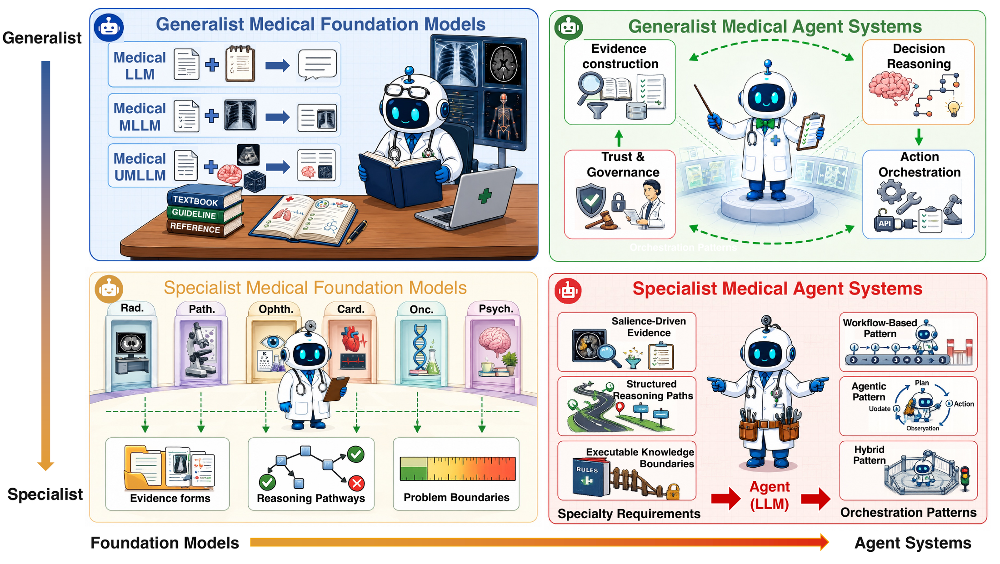
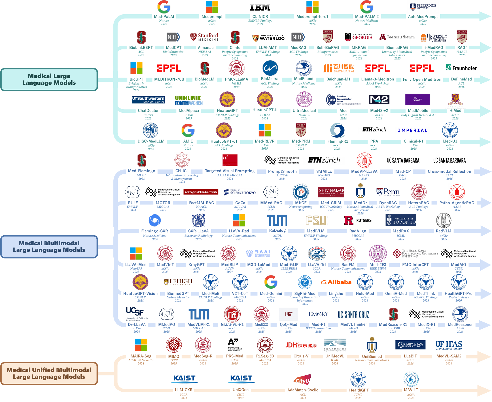
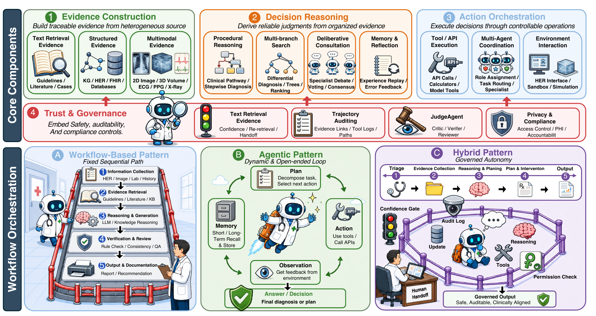
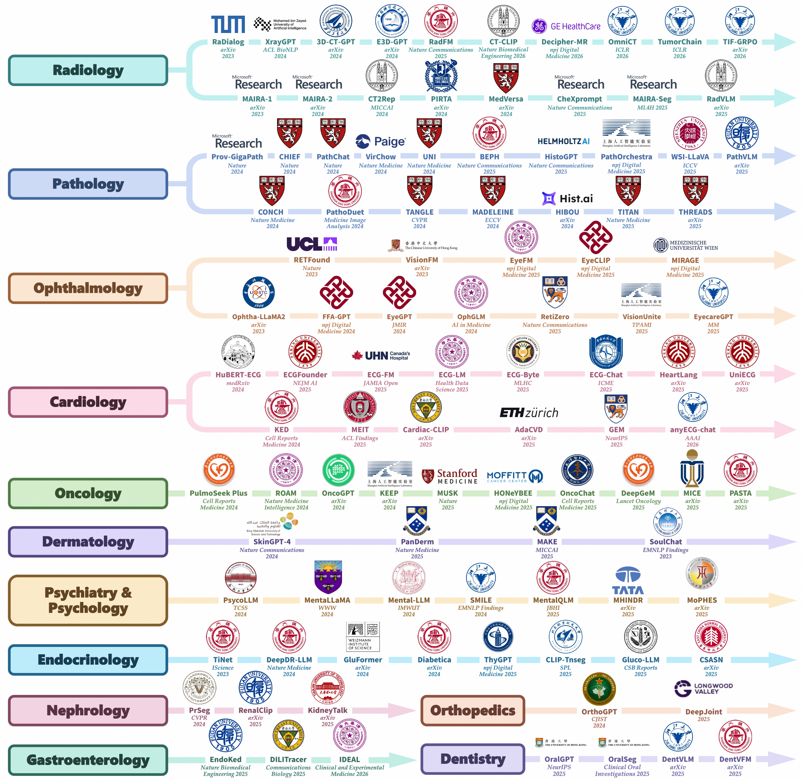
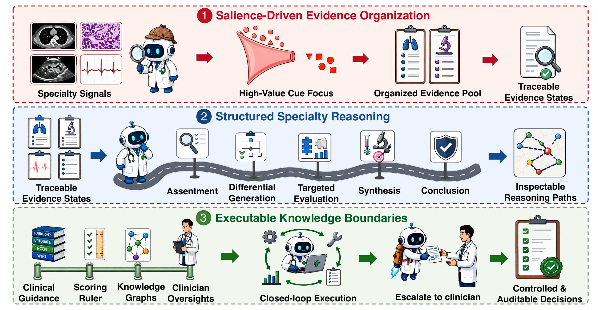

<div align="center">

# 🏥 Awesome Medical LLMs & Agents
### Toward Clinical-Ready Medical AI — A Survey of Medical **LLMs · MLLMs** & **Agent Systems**



</div>

---

> **TL;DR** — This repository accompanies our survey *Toward Clinical-Ready Medical AI — Surveying Foundation Models and Agent Systems*.
> It tracks **~400 works (2020–2026)** on medical **LLMs**, **MLLMs**, and **agent systems**, and organizes them around a single question:
> *not who scores highest on an isolated benchmark, but which systems can reliably organize evidence, reason, act, and accept supervision inside real clinical workflows.*

We argue that **clinical readiness** requires the *simultaneous* satisfaction of **four principles** — and that these principles expose **two structural tensions** (**model vs. system**, **generalist vs. specialist**) whose intersection yields **four research paradigms** that give this list its shape.

### 🧭 The Four Principles of Clinical Readiness
- 📚 **Evidence Sufficiency** — acquire, align, integrate, and continuously update multi-source, traceable evidence, rather than leaning on static parametric memory.
- 🧠 **Reasoning Trustworthiness** — produce reasoning that conforms to medical logic and guideline constraints while expressing uncertainty, rather than fluent-but-unsupported conclusions.
- 🛡️ **Decision Controllability & Auditability** — turn generation into an interventionable, accountable decision chain via tool use, state management, human–AI collaboration, and logging.
- 🎯 **Specialty Adequacy** — customize deeply for a specialty's evidence modalities, reasoning patterns, and standard operating procedures.

### 🗺️ The Four Paradigms (how this list is organized)
| | **Foundation Model** (knowledge & perception) | **Agent System** (execution & governance) |
|:---:|:---|:---|
| **Generalist** | 🧩 **[Generalist Medical Foundation Models](#2-generalist-medical-foundation-models)** — unified knowledge/perception via medical LLMs & MLLMs | 🤖 **[Generalist Medical Agent Systems](#3-generalist-medical-agent-systems)** — models embedded in workflows: retrieval, planning, tools, state |
| **Specialist** | 🔬 **[Specialist Medical Foundation Models](#4-specialist-medical-foundation-models)** — deep adaptation to specialty evidence & reasoning | 🩺 **[Specialist Medical Agent Systems](#5-specialist-medical-agent-systems)** — specialty models + guideline rules + human–AI closed loops |

> 🔎 **Scope.** We include LLM/MLLM/agent works applied to medicine; task-specific ML without large-model involvement is out of scope. A work is a **model** when its core contribution is architecture, training, or representation, and a **system** when it explicitly adds tool calling, external state, multi-step planning, or human-in-the-loop interaction.

## 📋 Table of Contents

- [1. Benchmarks & Datasets](#1-benchmarks--datasets)
  - [A. Generalist Training Corpora](#a-generalist-training-corpora)
  - [B. Generalist Evaluation Benchmarks](#b-generalist-evaluation-benchmarks)
  - [C. Specialty-Specific Benchmarks](#c-specialty-specific-benchmarks)
- [2. Generalist Medical Foundation Models](#2-generalist-medical-foundation-models)
  - [A. Medical Large Language Models](#a-medical-large-language-models)
  - [B. Medical Multimodal LLMs](#b-medical-multimodal-llms)
  - [C. Unified Medical MLLMs](#c-unified-medical-mllms)
- [3. Generalist Medical Agent Systems](#3-generalist-medical-agent-systems)
  - [A. Core Components](#a-core-components)
  - [B. Workflow & Orchestration Patterns](#b-workflow--orchestration-patterns)
- [4. Specialist Medical Foundation Models](#4-specialist-medical-foundation-models)
  - [Radiology](#a-radiology) · [Pathology](#b-pathology) · [Ophthalmology](#c-ophthalmology) · [Cardiology](#d-cardiology) · [Oncology](#e-oncology) · [Dermatology](#f-dermatology) · [Psychiatry & Psychology](#g-psychiatry--psychology) · [Endocrinology](#h-endocrinology) · [Nephrology](#i-nephrology) · [Gastroenterology](#j-gastroenterology) · [Orthopedics](#k-orthopedics) · [Dentistry](#l-dentistry)
- [5. Specialist Medical Agent Systems](#5-specialist-medical-agent-systems)
- [📌 Citation](#-citation)

---

## 1. Benchmarks & Datasets

Resources for training and evaluating generalist and specialist medical models. `D` = training data, `B` = benchmark. Scale is in the survey tables.

### A. Generalist Training Corpora

| Dataset | Venue | Task / Highlight | Links |
|:---|:---:|:---|:---:|
| **S2ORC** | `ACL 2020` | Open academic corpus; biomedical subset for LLM pretraining | [](https://huggingface.co/datasets/AlgorithmicResearchGroup/s2orc_full) |
| **MedQA** | `Applied Sciences 2021` | USMLE/MCMLE/TWMLE licensing-exam QA across three languages | [](https://huggingface.co/datasets/GBaker/MedQA-USMLE-4-options) |
| **MedMCQA** | `CHIL 2022` | Multi-subject medical entrance exam MCQ spanning 21 disciplines | [](https://huggingface.co/datasets/openlifescienceai/medmcqa) |
| **PubMedQA** | `EMNLP 2019` | Biomedical literature yes/no/maybe QA from PubMed abstracts | [](https://huggingface.co/datasets/qiaojin/PubMedQA) |
| **MultiMedQA** | `Nature 2023` | Aggregated medical QA with expert evaluation of open-ended responses | [](https://huggingface.co/datasets/openlifescienceai/multimedqa) |
| **AlpaCare** | `arXiv 2023` | GPT-4-seeded medical instruction-response pairs | [](https://arxiv.org/abs/2310.14558) [](https://huggingface.co/datasets/lavita/AlpaCare-MedInstruct-52k) |
| **ChatDoctor** | `Cureus 2023` | Real patient–physician conversation pairs for dialogue alignment | [](https://huggingface.co/datasets/lavita/ChatDoctor-HealthCareMagic-100k) |
| **HuatuoGPT2** | `arXiv 2023` | GPT-4-generated Chinese medical instruction data | [](https://arxiv.org/abs/2311.09774) [](https://huggingface.co/datasets/FreedomIntelligence/HuatuoGPT2-SFT-GPT4-140K) |
| **Asclepius** | `ACL Findings 2024` | Synthetic discharge summaries for clinical note understanding | [](https://huggingface.co/datasets/starmpcc/Asclepius-Synthetic-Clinical-Notes) |
| **MedReason** | `arXiv 2025` | Knowledge-graph-driven step-by-step medical reasoning chains | [](https://arxiv.org/abs/2504.00993) [](https://huggingface.co/datasets/UCSC-VLAA/MedReason) |
| **ReasonMed** | `EMNLP 2025` | Multi-agent validated complex CoT medical reasoning paths | [](https://huggingface.co/datasets/lingshu-medical-mllm/ReasonMed) |
| **UltraMedical** | `arXiv 2024` | High-quality biomedical instructions with preference annotations | [](https://arxiv.org/abs/2406.03949) [](https://huggingface.co/datasets/TsinghuaC3I/UltraMedical) |
| **MedS-Ins** | `npj Digit. Med. 2025` | 58-corpus aggregated medical instruction set covering 122 tasks | [](https://doi.org/10.1038/s41746-024-01390-4) [](https://huggingface.co/datasets/Henrychur/MedS-Ins) |
| **Med-PRM** | `arXiv 2025` | RAG-based stepwise process reward for reasoning verification | [](https://arxiv.org/abs/2508.02587) [](https://huggingface.co/datasets/dmis-lab/llama-3.1-medprm-reward-test-set) |
| **PMC-Patients** | `Sci. Data 2023` | Patient case summaries from PubMed Central for clinical retrieval | [](https://doi.org/10.1038/s41597-023-02814-8) [](https://huggingface.co/datasets/zhengyun21/PMC-Patients) |
| **MMedC** | `Nat. Commun. 2024` | Multilingual medical pretraining corpus across 6+ languages | [](https://doi.org/10.1038/s41467-024-52417-z) [](https://huggingface.co/datasets/Henrychur/MMedC) |
| **MIMIC-III** | `Sci. Data 2016` | ICU clinical database with diagnoses, labs, vitals, and notes | [](https://www.nature.com/articles/sdata201635) [](https://physionet.org/content/mimiciii/) |
| **MIMIC-IV** | `Sci. Data 2023` | Extended hospital-wide EHR with expanded patient coverage | [](https://www.nature.com/articles/s41597-022-01899-x) [](https://physionet.org/content/mimiciv/) |
| **eICU** | `Sci. Data 2018` | Multi-center ICU database for cross-hospital generalization | [](https://pmc.ncbi.nlm.nih.gov/articles/PMC6132188/) [](https://eicu-crd.mit.edu/) |
| **AmsterdamUMCdb** | `Critical Care Medicine 2021` | High-resolution ICU records for temporal clinical modeling | [](https://doi.org/10.1097/CCM.0000000000004916) |
| **MIMIC-IV-Note** | `2023` | Discharge summaries and radiology reports for clinical NLP | [](https://doi.org/10.13026/1n74-ne17) |
| **CMB** | `NAACL 2024` | Chinese medical licensing exam and clinical case QA | [](https://aclanthology.org/2024.naacl-long.343/) [](https://github.com/FreedomIntelligence/CMB) |
| **CMExam** | `NeurIPS 2023` | Chinese medical examination benchmark across specialties | [](https://huggingface.co/datasets/fzkuji/CMExam) |
| **MedBench** | `AAAI 2024` | Chinese multi-source medical evaluation with clinical cases | [](https://huggingface.co/datasets/nhyydt/MedBench_Resident) |
| **ChestX-ray14** | `CVPR 2017` | Chest X-ray multi-label classification with 14 disease labels | [](https://huggingface.co/datasets/arudaev/chest-xray-14-320) |
| **CheXpert** | `AAAI 2019` | Large-scale chest radiographs with uncertainty-aware labels | [](https://huggingface.co/datasets/danjacobellis/chexpert) |
| **CheXpert Plus** | `arXiv 2024` | CheXpert augmented with paired radiology report text | [](https://arxiv.org/abs/2405.19538) [](https://huggingface.co/datasets/X-iZhang/CheXpert-plus-RRG) |
| **MIMIC-CXR** | `Sci. Data 2019` | Chest X-rays with free-text radiology reports | [](https://www.nature.com/articles/s41597-019-0322-0) [](https://physionet.org/content/mimic-cxr/) |
| **IU-Xray** | `JAMIA 2016` | Chest X-ray images paired with structured radiology reports | [](https://huggingface.co/datasets/CAIR-M3LLM/IU-Xray) |
| **ROCO** | `MICCAI-W` | Radiology image–caption pairs with concept annotations | [](https://github.com/razorx89/roco-dataset) |
| **ROCOv2** | `Sci. Data 2024` | Updated radiology image–caption resource with enriched concepts | [](https://huggingface.co/datasets/eltorio/ROCOv2-radiology) |
| **MedICaT** | `EMNLP Findings 2020` | Medical figures with captions from biomedical papers | [](https://aclanthology.org/2020.findings-emnlp.191/) [](https://github.com/allenai/medicat) |
| **PMC-15M** | `ICLR 2024` | Large-scale PMC image–caption pairs for biomedical CLIP | [](https://arxiv.org/abs/2303.00915) [](https://huggingface.co/microsoft/BiomedCLIP-PubMedBERT_256-vit_base_patch16_224) |
| **PMC-OA** | `MICCAI 2023` | Subfigure-level image–caption pairs from PMC Open Access | [](https://huggingface.co/datasets/axiong/pmc_oa) |
| **PubMedVision** | `EMNLP 2024` | Medical VQA samples for vision–language alignment at scale | [](https://huggingface.co/datasets/CAIR-M3LLM/PubMedVision) |
| **BIOMEDICA** | `CVPR 2025` | Full PMC image–text archive with expert concept annotations | [](https://huggingface.co/datasets/BIOMEDICA/biomedica_webdataset_24M) |
| **MedTrinity-25M** | `ICLR 2025` | Multi-granularity annotated medical images across 10 modalities | [](https://huggingface.co/datasets/UCSC-VLAA/MedTrinity-25M) |
| **Open-PMC-18M** | `arXiv 2025` | High-fidelity PMC image–text pairs with subfigure decomposition | [](https://arxiv.org/abs/2506.02738) [](https://huggingface.co/datasets/vector-institute/open-pmc-18m) |
| **LLaVA-Med** | `NeurIPS 2023` | Biomedical visual instruction tuning for multimodal assistants | [](https://huggingface.co/datasets/myeongkyunkang/LLaVA-Med-60K-IM-text) |
| **Quilt-LLaVA** | `CVPR 2024` | Histopathology visual instruction data from educational videos | [](https://huggingface.co/datasets/wisdomik/QUILT-LLaVA-Instruct-107K) |
| **GMAI-R10K** | `arXiv 2025` | Medical image reasoning with CoT annotations across 12 modalities | [](https://arxiv.org/abs/2504.01886) |
| **MedMax** | `NeurIPS 2025` | Mixed-modal instruction tuning for interleaved generation | [](https://huggingface.co/datasets/mint-medmax/medmax_data) |
| **S-Chain** | `arXiv 2025` | Expert-annotated structured visual CoT across 16 languages | [](https://arxiv.org/abs/2510.22728) [](https://huggingface.co/datasets/leduckhai/S-Chain) |
| **MMedPO** | `arXiv 2025` | Clinically aware multimodal preference optimization data | [](https://arxiv.org/abs/2412.06141) |

### B. Generalist Evaluation Benchmarks

| Dataset | Venue | Task / Highlight | Links |
|:---|:---:|:---|:---:|
| **MMLU-Med** | `arXiv 2020` | Medical knowledge subset of multi-task language understanding | [](https://arxiv.org/abs/2009.03300) [](https://huggingface.co/datasets/openlifescienceai/mmlu_medical_genetics) |
| **MMLU-Pro-Med** | `NeurIPS 2024` | Harder 10-option medical MCQ for robust reasoning evaluation | [](https://huggingface.co/datasets/meoconxinhxan/Medical-Eval-MMLU-Pro_Medical_test) |
| **BioASQ** | `BMC Bioinformatics 2015` | Biomedical semantic indexing and QA challenge (13 editions) | [](https://doi.org/10.1186/s12859-015-0564-6) [](https://huggingface.co/datasets/jmhb/pubmed_bioasq_2022) |
| **MMedBench** | `Nat. Commun. 2024` | Multilingual medical QA across 6 languages and 21 subfields | [](https://doi.org/10.1038/s41467-024-52417-z) [](https://huggingface.co/datasets/Henrychur/MMedC) |
| **MedBullets** | `NAACL 2025` | USMLE Step 2/3 clinical MCQ with expert explanations | [](https://huggingface.co/datasets/mkieffer/Medbullets) |
| **SuperGPQA-Med** | `NeurIPS 2025` | Graduate-level QA medical subset across 285 disciplines | [](https://arxiv.org/abs/2502.14739) [](https://github.com/SuperGPQA/SuperGPQA) |
| **HealthBench** | `arXiv 2025` | Multi-turn health dialogues with 48.6K physician rubrics | [](https://arxiv.org/abs/2505.08775) [](https://huggingface.co/datasets/openai/healthbench) |
| **HealthBench Pro** | `arXiv 2026` | Clinician-focused tasks for documentation and clinical reasoning | [](https://arxiv.org/abs/2604.27470) [](https://huggingface.co/datasets/openai/healthbench-professional) |
| **DiagnosisArena** | `arXiv 2025` | Complex clinical case diagnosis across 28 specialties | [](https://arxiv.org/abs/2505.14107) [](https://huggingface.co/datasets/SII-SPIRAL-MED/DiagnosisArena) |
| **MedXpertQA** | `arXiv 2025` | Expert-level 10-option medical reasoning across 17 specialties | [](https://arxiv.org/abs/2501.18362) [](https://huggingface.co/datasets/TsinghuaC3I/MedXpertQA) |
| **RareBench** | `KDD 2024` | Rare disease differential diagnosis across 421 diseases | [](https://huggingface.co/datasets/chenxz/RareBench) |
| **ReDis-QA** | `arXiv 2024` | Rare disease diagnostic QA with multi-aspect evaluation | [](https://arxiv.org/abs/2408.08422) [](https://huggingface.co/datasets/guan-wang/ReDis-QA) |
| **MedCalc-Bench** | `NeurIPS 2024` | Quantitative medical calculation across 55 scoring systems | [](https://huggingface.co/datasets/nsk7153/MedCalc-Bench-Verified) |
| **MedR-Bench** | `Nat. Commun. 2025` | Three-stage clinical reasoning: exam–diagnosis–treatment | [](https://doi.org/10.1038/s41467-025-64769-1) [](https://huggingface.co/datasets/Henrychur/MedRbench-Inference-Results) |
| **MedHallu** | `EMNLP 2025` | Medical hallucination detection with difficulty stratification | [](https://huggingface.co/datasets/UTAustin-AIHealth/MedHallu) |
| **MedHELM** | `Nature Medicine 2026` | Holistic 35-benchmark evaluation validated by 29 clinicians | [](https://doi.org/10.1038/s41591-025-04151-2) [](https://huggingface.co/datasets/Prado2026/medhelm_med_mcqa) |
| **BRIDGE** | `Nat. Biomed. Eng. 2026` | Multilingual clinical benchmark; 9 languages, 59 sources | [](https://doi.org/10.1038/s41551-026-01719-2) |
| **EHRBench** | `KDD 2026` | Automated EHR-based clinical decision benchmark | [](https://huggingface.co/datasets/BlueZeros/EHR-Bench) |
| **emrQA** | `EMNLP 2018` | QA over electronic medical records for evidence extraction | [](https://huggingface.co/datasets/Eladio/emrqa-msquad) |
| **RadQA** | `LREC 2022` | Radiology report comprehension QA | [](https://aclanthology.org/2022.lrec-1.672/) |
| **MedNLI** | `EMNLP 2018` | Clinical natural language inference from EHR sentences | [](https://aclanthology.org/D18-1187/) [](https://huggingface.co/datasets/presencesw/mednli) |
| **MIMICSQL** | `WWW 2020` | Natural-language-to-SQL over clinical databases | [](https://arxiv.org/abs/1908.01839) [](https://github.com/wangpinggl/TREQS) |
| **EHRSQL** | `NeurIPS 2022` | Text-to-SQL with answerable/unanswerable clinical queries | [](https://huggingface.co/datasets/JimHue/EHRSQL_PostgreSQL_data) |
| **LLMEval-Med** | `arXiv 2025` | Open-ended EHR reasoning with expert-checklist evaluation | [](https://arxiv.org/abs/2506.04078) [](https://huggingface.co/datasets/llmeval-fdu/LLMEval-Med) |
| **MedAgentBench** | `arXiv 2025` | FHIR-based clinical agent tasks over 700K+ EHR data elements | [](https://doi.org/10.48550/arXiv.2501.14654) [](https://huggingface.co/datasets/DCAgent/medagentbench) |
| **AgentClinic** | `arXiv 2024` | Interactive clinical agent benchmark with sequential decisions | [](https://arxiv.org/abs/2405.07960) [](https://huggingface.co/datasets/katielink/agentclinic_medqa) |
| **VQA-RAD** | `Sci. Data 2018` | Clinician-posed radiology visual QA | [](https://huggingface.co/datasets/flaviagiammarino/vqa-rad) |
| **SLAKE** | `ISBI 2021` | Bilingual medical VQA with knowledge graph integration | [](https://huggingface.co/datasets/BoKelvin/SLAKE) |
| **PathVQA** | `ACL 2021` | Pathology image QA spanning tissue, cell, and staining types | [](https://huggingface.co/datasets/flaviagiammarino/path-vqa) |
| **PMC-VQA** | `Commun. Med. 2024` | Large-scale medical VQA from PubMed Central article images | [](https://huggingface.co/datasets/RadGenome/PMC-VQA) |
| **OmniMedVQA** | `CVPR 2024` | Comprehensive multi-modality, multi-region medical VQA | [](https://huggingface.co/datasets/foreverbeliever/OmniMedVQA) |
| **MMMU-Med** | `CVPR 2024` | Expert-level multimodal understanding across medical disciplines | [](https://huggingface.co/datasets/CAIR-HKISI/MMMU_med) |
| **WorldMedQA-V** | `NAACL Findings 2025` | Multilingual multimodal medical exam from 4 countries | [](https://huggingface.co/datasets/WorldMedQA/V) |
| **MedFrameQA** | `arXiv 2025` | Multi-image sequential medical reasoning from video frames | [](https://arxiv.org/abs/2505.16964) [](https://huggingface.co/datasets/SuhaoYu1020/MedFrameQA) |
| **MedXpertQA-MM** | `arXiv 2025` | Expert-level multimodal clinical reasoning with patient context | [](https://arxiv.org/abs/2501.18362) [](https://huggingface.co/datasets/TsinghuaC3I/MedXpertQA) |
| **GMAI-MMBench** | `NeurIPS 2024` | Cross-modality, cross-task generalization across 38 modalities | [](https://huggingface.co/datasets/VLMEval/GMAI-MMBench) |
| **M3CoTBench** | `ICLR 2026` | Medical image CoT reasoning across 24 examination types | [](https://huggingface.co/datasets/APRIL-AIGC/M3CoTBench) |

### C. Specialty-Specific Benchmarks

| Benchmark | Specialty | Venue | Links |
|:---|:---|:---:|:---:|
| **VQA-RAD** | Radiology | `Sci. Data 2018` | [](https://huggingface.co/datasets/flaviagiammarino/vqa-rad) |
| **VQA-Med** | Radiology | `CLEF` | [](https://huggingface.co/datasets/claudioreeves/imageclef-vqa-med-2019) |
| **SLAKE** | Radiology | `ISBI 2021` | [](https://huggingface.co/datasets/BoKelvin/SLAKE) |
| **RadBench** | Radiology | `Nat. Commun. 2025` | [](https://www.nature.com/articles/s41467-025-62385-7) [](https://github.com/chaoyi-wu/RadFM) |
| **GMAI-MMBench** | Radiology | `NeurIPS 2024` | [](https://huggingface.co/datasets/VLMEval/GMAI-MMBench) |
| **M3D-Bench** | Radiology | `arXiv 2024` | [](https://arxiv.org/abs/2404.00578) [](https://huggingface.co/datasets/MSheng-Lee/M3DBench) |
| **CT-RATE** | Radiology | `Nat. Biomed. Eng. 2025` | [](https://doi.org/10.1038/s41551-025-01599-y) [](https://huggingface.co/datasets/ibrahimhamamci/CT-RATE) |
| **AMOS-MM** | Radiology | `2024` | [](https://huggingface.co/datasets/introvoyz041/AMOS-MM-Solution) |
| **PathVQA** | Pathology | `arXiv 2020` | [](https://arxiv.org/abs/2003.10286) [](https://huggingface.co/datasets/flaviagiammarino/path-vqa) |
| **WSI-VQA** | Pathology | `ECCV 2024` | [](https://arxiv.org/abs/2407.05603) [](https://github.com/cpystan/WSI-VQA) |
| **SlideBench** | Pathology | `CVPR 2025` | [](https://arxiv.org/abs/2410.11761) [](https://github.com/uni-medical/SlideChat) |
| **PathBench** | Pathology | `IEEE TMI 2025` | [](https://pubmed.ncbi.nlm.nih.gov/40601458/) |
| **WSI-Bench** | Pathology | `ICCV 2025` | [](https://huggingface.co/datasets/Lucas-yuc/WSI-Bench) |
| **OphthalWeChat** | Ophthalmology | `Adv. Ophthalmol. Pract. Res. 2025` | [](https://arxiv.org/abs/2505.19624) |
| **EyeCare-Bench** | Ophthalmology | `ACM MM 2025` | [](https://arxiv.org/abs/2504.13650) [](https://github.com/dcdmllm/eyecaregpt) |
| **ECG-QA** | Cardiology | `NeurIPS 2023` | [](https://huggingface.co/datasets/willxxy/ecg-qa-mimic-iv-ecg-250-2500) |
| **ECG-Expert-QA** | Cardiology | `IEEE Conf.` | [](https://arxiv.org/abs/2502.17475) |
| **ECG-Reasoning** | Cardiology | `arXiv 2026` | [](https://arxiv.org/abs/2603.14326) [](https://huggingface.co/datasets/Jwoo5/ECG-Reasoning-Benchmark) |
| **OncoGPT** | Oncology | `arXiv 2024` | [](https://arxiv.org/abs/2402.16810) [](https://huggingface.co/datasets/wangd12/oncogpt_projector_train) |
| **MTBBench** | Oncology | `NeurIPS 2026` | [](https://huggingface.co/datasets/EeshaanJain/MTBBench) |
| **CORAL** | Oncology | `NEJM AI 2024` | [](https://arxiv.org/abs/2308.03853) [](https://github.com/MadhumitaSushil/OncLLMExtraction) |
| **MM-Skin** | Dermatology | `ACM MM 2025` | [](https://arxiv.org/abs/2505.06152) [](https://github.com/ZwQ803/MM-Skin) |
| **DermaBench** | Dermatology | `arXiv 2026` | [](https://arxiv.org/abs/2601.14084) |
| **PsyQA** | Psychiatry & Psychology | `ACL Findings 2021` | [](https://huggingface.co/datasets/lsy641/PsyQA) |
| **SoulChatCorpus** | Psychiatry & Psychology | `EMNLP Findings 2023` | [](https://huggingface.co/datasets/scutcyr/SoulChatCorpus) |
| **MentalChat16K** | Psychiatry & Psychology | `KDD 2025` | [](https://huggingface.co/datasets/ShenLab/MentalChat16K) |
| **PsychBench** | Psychiatry & Psychology | `arXiv 2025` | [](https://arxiv.org/abs/2502.01192) [](https://huggingface.co/datasets/BMEr-ATP/PsychBench) |
| **PsychiatryBench** | Psychiatry & Psychology | `npj Digit. Med. 2025` | [](https://www.nature.com/articles/s41746-026-02582-w) |
| **Kvasir-VQA** | Gastroenterology | `Workshop` | [](https://huggingface.co/datasets/SimulaMet/Kvasir-VQA-x1) |
| **EndoBench** | Gastroenterology | `NeurIPS 2026` | [](https://huggingface.co/datasets/Saint-lsy/EndoBench) |
| **DentalBench** | Dentistry | `arXiv 2025` | [](https://arxiv.org/abs/2508.20416) |
| **MMOral-OPG-Bench** | Dentistry | `NeurIPS 2026` | [](https://huggingface.co/datasets/OralGPT/MMOral-OPG-Bench) |

---

## 2. Generalist Medical Foundation Models

> **Generalist–Model.** Establish a unified knowledge and perception foundation through medical LLMs and MLLMs.

<div align="center"></div>

### A. Medical Large Language Models

*Language-centric clinical modeling.*

#### Context-Based Knowledge Injection

_Augment a frozen model at inference time via prompting and retrieval-augmented generation._

| Model | Paper | Venue | Links |
|:---|:---|:---:|:---:|
| **Med-PaLM** | Large language models encode clinical knowledge | `Nature 2023` | [](https://doi.org/10.1038/s41586-023-06291-2) |
| **Med-PaLM 2** | Toward Expert-Level Medical Question Answering with Large Language Models | `Nature Medicine 2025` | [](https://doi.org/10.1038/s41591-024-03423-7) |
| **Medprompt** | Can Generalist Foundation Models Outcompete Special-Purpose Tuning? Case Study in Medicine | `arXiv 2023` | [](https://arxiv.org/abs/2311.16452) |
| **Medprompt-to-o1** | From Medprompt to o1: Exploration of Run-Time Strategies for Medical Challenge Problems and Beyond | `arXiv 2024` | [](https://arxiv.org/abs/2411.03590) |
| **AutoMedPrompt** | AutoMedPrompt: A New Framework for Optimizing LLM Medical Prompts Using Textual Gradients | `arXiv 2025` | [](https://arxiv.org/abs/2502.15944) [](https://github.com/SeanWu25/AutoMedPrompt) |
| **MedCPT** | MedCPT: Contrastive Pre-trained Transformers with Large-scale PubMed Search Logs for Zero-shot Biomedical Information Retrieval | `Bioinformatics 2023` | [](https://doi.org/10.1093/bioinformatics/btad651) [](https://github.com/ncbi/MedCPT) |
| **BioLinkBERT** | LinkBERT: Pretraining Language Models with Document Links | `ACL 2022` | [](https://doi.org/10.18653/v1/2022.acl-long.551) |

#### Training-Based Knowledge Internalization

_Encode medical knowledge into parameters: continual pretraining, SFT, and reasoning-oriented alignment._

| Model | Paper | Venue | Links |
|:---|:---|:---:|:---:|
| **BioGPT** | BioGPT: generative pre-trained transformer for biomedical text generation and mining | `Brief. Bioinform. 2022` | [](https://doi.org/10.1093/bib/bbac409) |
| **BioMedLM** | BioMedLM: A 2.7B Parameter Language Model Trained On Biomedical Text | `arXiv 2024` | [](https://arxiv.org/abs/2403.18421) |
| **BioMistral** | BioMistral: A Collection of Open-Source Pretrained Large Language Models for Medical Domains | `ACL 2024` | [](https://doi.org/10.18653/v1/2024.findings-acl.348) |
| **PMC-LLaMA** | PMC-LLaMA: toward building open-source language models for medicine | `JAMIA 2024` | [](https://doi.org/10.1093/jamia/ocae045) [](https://github.com/chaoyi-wu/PMC-LLaMA) |
| **MEDITRON-70B** | MEDITRON-70B: Scaling medical pretraining for large language models | `arXiv 2023` | [](https://arxiv.org/abs/2311.16079) |
| **MedFound** | MedFound-1: A Foundation Model for General Medical Tasks Built on Healthcare-first Data Pipeline | `arXiv 2025` | [](https://arxiv.org/abs/2501.19274) |
| **Baichuan-M1** | Baichuan-M1: Pushing the Medical Capability of Large Language Models | `arXiv 2025` | [](https://arxiv.org/abs/2502.12671) |
| **Llama-3-Meditron** | Llama-3-Meditron: An Open-Weight Suite of Medical LLMs Based on Llama-3.1 | `AAAI 2024` | [](https://openreview.net/forum?id=ZcD35zKujO) |
| **DeFineMed** | Can Continual Pre-training Bridge the Performance Gap between General-purpose and Specialized Language Models in the Medical Domain? | `ACL 2026` | [](https://arxiv.org/abs/2604.19394) |
| **MedAlpaca** | MedAlpaca – An Open-Source Collection of Medical Conversational AI Models and Training Data | `arXiv 2023` | [](https://arxiv.org/abs/2304.08247) |
| **HuatuoGPT** | HuatuoGPT: Taming Language Model to Be a Doctor | `arXiv 2023` | [](https://doi.org/10.18653/v1/2023.findings-emnlp.725) [](https://github.com/FreedomIntelligence/HuatuoGPT) |
| **MedMobile** | MedMobile: A Mobile-Sized Language Model with Expert-Level Clinical Capabilities | `arXiv 2024` | [](https://doi.org/10.1136/bmjdhai-2025-000068) [](https://github.com/nyuolab/MedMobile) |
| **HuatuoGPT-II** | HuatuoGPT-II, One-stage Training for Medical Adaption of LLMs | `arXiv 2023` | [](https://arxiv.org/abs/2311.09774) [](https://github.com/FreedomIntelligence/HuatuoGPT-II) |
| **Aloe** | Aloe: A Family of Fine-tuned Open Healthcare LLMs | `arXiv 2024` | [](https://arxiv.org/abs/2405.01886) [](https://github.com/ShujinWu-0814/ALOE) |
| **Med42-v2** | Med42-v2: A Suite of Clinical LLMs | `arXiv 2024` | [](https://arxiv.org/abs/2408.06142) |
| **HiMed** | HiMed: Incentivizing Hindi Reasoning in Medical LLMs | `arXiv 2026` | [](https://arxiv.org/abs/2605.24635) |
| **DISC-MedLLM** | DISC-MedLLM: Bridging General Large Language Models and Real-World Medical Consultation | `arXiv 2023` | [](https://arxiv.org/abs/2308.14346) [](https://github.com/FudanDISC/DISC-MedLLM) |
| **AMIE** | Towards Conversational Diagnostic Artificial Intelligence | `Nature 2025` | [](https://doi.org/10.1038/s41586-025-08866-7) |
| **HuatuoGPT-o1** | HuatuoGPT-o1, Towards Medical Complex Reasoning with LLMs | `ACL Findings 2025` | [](https://arxiv.org/abs/2412.18925) [](https://github.com/FreedomIntelligence/HuatuoGPT-o1) |
| **Med-RLVR** | Med-RLVR: Emerging Medical Reasoning through Verifiable Rewards | `arXiv 2025` | [](https://arxiv.org/abs/2502.09418) |
| **Fleming-R1** | Fleming-R1: Advancing Medical Reasoning with a Knowledge-Graph-Enhanced Reinforcement Learning Framework | `arXiv 2025` | [](https://arxiv.org/abs/2508.11475) [](https://github.com/IQuestLab/Fleming-R1) |
| **PRA** | Process Reward Agents for Steering Knowledge-Intensive Reasoning | `arXiv 2026` | [](https://arxiv.org/abs/2604.09482) |
| **Clinical-R1** | Clinical-R1: Empowering Large Language Models for Faithful and Comprehensive Reasoning with Clinical Objective Relative Policy Optimization | `arXiv 2025` | [](https://arxiv.org/abs/2512.00601) |
| **Med-U1** | Med-U1: Multi-Objective Reinforcement Learning for Faithful and Comprehensive Medical Reasoning | `arXiv 2025` | [](https://arxiv.org/abs/2505.20379) [](https://github.com/Monncyann/Med-U1) |

### B. Medical Multimodal LLMs

*Cross-modal clinical evidence modeling — X-ray, CT, MRI, pathology, ultrasound, ECG, and structured signals.*

#### Context-Based Multimodal Evidence Injection

| Model | Paper | Venue | Links |
|:---|:---|:---:|:---:|
| **RULE** | RULE: Reliable Multimodal RAG for Factuality in Medical Vision Language Models | `EMNLP 2024` | [](https://aclanthology.org/2024.emnlp-main.62/) |
| **CXR-LLaVA** | CXR-LLaVA: A Multimodal Large Language Model for Interpreting Chest X-ray Images | `Eur. Radiol. 2025` | [](https://doi.org/10.1007/s00330-024-11339-6) |
| **LLaVA-Rad** | A clinically accessible small multimodal radiology model and evaluation metric for chest X-ray findings | `Nat. Commun. 2025` | [](https://doi.org/10.1038/s41467-025-58344-x) [](https://github.com/microsoft/LLaVA-Rad) |
| **Flamingo-CXR** | Collaboration Between Clinicians and Vision–Language Models in Radiology Report Generation | `Nature Medicine 2025` | [](https://doi.org/10.1038/s41591-024-03302-1) |
| **CheXagent** | CheXagent: Towards a Foundation Model for Chest X-Ray Interpretation | `arXiv 2024` | [](https://doi.org/10.48550/arXiv.2401.12208) [](https://github.com/Stanford-AIMI/CheXagent) |
| **RaDialog** | RaDialog: Large Vision-Language Models for X-Ray Reporting and Dialog-Driven Assistance | `MIDL 2025` | [](https://openreview.net/forum?id=trUvr1gSNI) [](https://github.com/ChantalMP/RaDialog) |
| **RadAlign** | RadAlign: Advancing Radiology Report Generation with Vision-Language Concept Alignment | `MICCAI 2025` | [](https://doi.org/10.1007/978-3-032-04981-0_46) [](https://github.com/rishita1404/RadAlign) |
| **MedRAX** | MedRAX: Medical Reasoning Agent for Chest X-ray | `ICML 2025` | [](https://arxiv.org/abs/2502.02673) [](https://github.com/bowang-lab/MedRAX) |
| **RadVLM** | RadVLM: a multitask conversational vision-language model for radiology | `arXiv 2025` | [](https://doi.org/10.1038/s41598-026-66181-1) [](https://github.com/uzh-dqbm-cmi/RadVLM) |

#### Direct Training-Based Multimodal Capability Construction

| Model | Paper | Venue | Links |
|:---|:---|:---:|:---:|
| **LLaVA-Med** | LLaVA-Med: Training a Large Language-and-Vision Assistant for Biomedicine in One Day | `arXiv 2024` | [](https://arxiv.org/abs/2306.00890) [](https://github.com/microsoft/LLaVA-Med) |
| **MedVInT** | PMC-VQA: Visual Instruction Tuning for Medical Visual Question Answering | `NeurIPS 2023` | [](https://arxiv.org/abs/2305.10415) |
| **XrayGPT** | Xraygpt: Chest radiographs summarization using large medical vision-language models | `BioNLP 2024` | [](https://doi.org/10.18653/v1/2024.bionlp-1.35) [](https://github.com/mbzuai-oryx/XrayGPT) |
| **Med-Flamingo** | Med-Flamingo: a Multimodal Medical Few-shot Learner | `ML4H 2023` | [](https://arxiv.org/abs/2307.15189) |
| **MedBLIP** | MedBLIP: Bootstrapping Language-Image Pre-training from 3D Medical Images and Texts | `ACCV 2024` | [](https://arxiv.org/abs/2305.10799) |
| **PMC-InterCPT** | PMC-InterCPT: Continual Pretraining with Interleaved PMC Image-Text Data for Medical Vision-Language Models | `arXiv 2026` | [](https://arxiv.org/abs/2601.04865) |
| **Med-GLIP** | Med-GLIP: Advancing Medical Language-Image Pre-training with Large-scale Grounded Dataset | `arXiv 2025` | [](https://doi.org/10.1109/bibm66473.2025.11357141) |
| **MedMO** | MedMO: Grounding and Understanding Multimodal Large Language Model for Medical Images | `CVPR 2026` | [](https://arxiv.org/abs/2602.06965) [](https://github.com/genmilab/MedMO) |
| **Med-2E3** | Med-2E3: A 2D Sub-Pixel and 3D Integration Framework for Superior Medical Image Segmentation | `arXiv 2024` | [](https://arxiv.org/abs/2403.17801) |
| **HuatuoGPT-Vision** | HuatuoGPT-Vision, Towards Injecting Medical Visual Knowledge into Multimodal LLMs at Scale | `EMNLP 2024` | [](https://arxiv.org/abs/2406.19280) [](https://github.com/FreedomIntelligence/HuatuoGPT-Vision) |
| **BiomedGPT** | BiomedGPT: A Unified and Generalist Biomedical Generative Pre-trained Transformer for Vision, Language, and Multimodal Tasks | `arXiv 2024` | [](https://arxiv.org/abs/2305.17100) [](https://github.com/taokz/BiomedGPT) |
| **SigPhi-Med** | SigPhi-Med: Lightweight Medical Visual Question Answering with Vision-Language Models | `arXiv 2025` | [](https://arxiv.org/abs/2503.09953) |
| **Lingshu** | Lingshu: A Generalist Foundation Model for Unified Multimodal Medical Understanding and Reasoning | `arXiv 2025` | [](https://arxiv.org/abs/2506.07044) |
| **OmniV-Med** | OmniV-Med: Scaling Medical Vision-Language Model for Universal Visual Understanding | `arXiv 2025` | [](https://arxiv.org/abs/2504.14692) |
| **Med-MoE** | Med-MoE: Mixture of Domain-Specific Experts for Lightweight Medical Vision-Language Models | `EMNLP Findings 2024` | [](https://aclanthology.org/2024.findings-emnlp.221/) [](https://github.com/jiangsongtao/Med-MoE) |
| **MedThink** | MedThink: A Rationale-Guided Framework for Explaining Medical Visual Question Answering | `NAACL Findings 2025` | [](https://aclanthology.org/2025.findings-naacl.415/) [](https://github.com/Tang-xiaoxiao/Medthink) |
| **V2T-CoT** | V2T-CoT: From Vision to Text Chain-of-Thought for Medical Reasoning and Diagnosis | `MICCAI 2025` | [](https://doi.org/10.1007/978-3-032-04971-1_62) |
| **Med-Gemini** | Advancing Multimodal Medical Capabilities of Gemini | `arXiv 2024` | [](https://arxiv.org/abs/2405.03162) |
| **Hulu-Med** | Hulu-Med: A Transparent Generalist Model towards Holistic Medical Vision-Language Understanding | `arXiv 2025` | [](https://arxiv.org/abs/2510.08668) [](https://github.com/ZJUI-AI4H/Hulu-Med) |
| **HealthGPT-Pro** | HealthGPT-Pro: A Medical Large Vision-Language Model for Clinical Multimodal Understanding and Generation | `arXiv 2025` | [](https://arxiv.org/abs/2505.07503) |
| **Dr-LLaVA** | Dr-LLaVA: Visual Instruction Tuning with Symbolic Clinical Grounding | `arXiv 2024` | [](https://arxiv.org/abs/2405.19567) [](https://github.com/AlaaLab/Dr-LLaVA) |
| **MedVLM-R1** | MedVLM-R1: Incentivizing Medical Reasoning Capability of Vision-Language Models via Reinforcement Learning | `MICCAI 2025` | [](https://doi.org/10.1007/978-3-032-04981-0_32) |
| **Med-R1** | Med-R1: Reinforcement Learning for Generalizable Medical Reasoning in Vision-Language Models | `arXiv 2025` | [](https://doi.org/10.1109/TMI.2026.3661001) [](https://github.com/Yuxiang-Lai117/Med-R1) |
| **GMAI-VL-R1** | GMAI-VL-R1: Harnessing Reinforcement Learning for Multimodal Medical Reasoning | `arXiv 2025` | [](https://arxiv.org/abs/2504.01886) |
| **MedVLThinker** | MedVLThinker: Simple Baselines for Multimodal Medical Reasoning | `arXiv 2025` | [](https://arxiv.org/abs/2508.02669) [](https://github.com/UCSC-VLAA/MedVLThinker) |
| **MedReason-R1** | Med-R1: Reinforcement Learning for Generalizable Medical Reasoning in Vision-Language Models | `2026` | [](https://doi.org/10.1109/tmi.2026.3661001) [](https://github.com/Leevan001/MedReason-R1) |
| **MedCCO** | MedCCo: Improving Medical Reasoning with Curriculum-Aware Reinforcement Learning | `arXiv 2025` | [](https://arxiv.org/abs/2505.19213) |
| **MediX-R1** | MediX-R1: A Medical Multimodal Reasoning Approach with Verifiable Reward Training | `arXiv 2026` | [](https://arxiv.org/abs/2601.15882) |
| **QoQ-Med** | QoQ-Med: Building Multimodal Clinical Foundation Models with Domain-Aware GRPO Training | `arXiv 2025` | [](https://arxiv.org/abs/2506.00711) |
| **MedReasoner** | MedReasoner: Reinforcement Learning Drives Reasoning Grounding from Clinical Thought to Pixel-Level Precision | `AAAI 2025` | [](https://doi.org/10.48448/vyhr-6345) [](https://github.com/PRIS-CV/MedReasoner) |

### C. Unified Medical MLLMs

*Unified clinical world modeling — joint understanding **and** generation.*

#### Decoder-Augmented Multimodal Generation

| Model | Paper | Venue | Links |
|:---|:---|:---:|:---:|
| **UniMedVL** | UniMedVL: Unifying Medical Multimodal Understanding And Generation Through Observation-Knowledge-Analysis | `arXiv 2025` | [](https://doi.org/10.6084/m9.figshare.32229360) [](https://github.com/uni-medical/UniMedVL) |
| **LLaBIT** | LLaBIT: Language Model for Brain Imaging Tasks | `2026` | [](https://github.com/jongdory/LLaBIT) |
| **UniBiomed** | UniBiomed: A Universal Foundation Model for Grounded Biomedical Image Interpretation | `arXiv 2025` | [](https://arxiv.org/abs/2504.21336) [](https://github.com/Luffy03/UniBiomed) |
| **MedVL-SAM2** | MedVL-SAM2: A Unified 3D Medical Vision-Language Model for Multimodal Reasoning and Prompt-Driven Segmentation | `arXiv 2026` | [](https://arxiv.org/abs/2601.09879) |
| **MIMO** | MIMO: A Medical Vision-Language Model with Visual Referring, Pixel Grounding, and Contextual Reasoning | `arXiv 2025` | [](https://arxiv.org/abs/2506.06139) |
| **MedSeg-R** | MedSeg-R: Reasoning Segmentation in Medical Images with Multimodal Large Language Models | `arXiv 2025` | [](https://arxiv.org/abs/2506.10465) [](https://github.com/haoshao-nku/MedSeg-R) |
| **PRS-Med** | PRS-Med: Position Reasoning Segmentation in Medical Imaging | `arXiv 2025` | [](https://arxiv.org/abs/2505.11872) [](https://github.com/huyquoctrinh/PRS-Med) |
| **R1Seg-3D** | R1Seg-3D: Rethinking Reasoning Segmentation for Medical 3D CTs | `MICCAI 2025` | [](https://papers.miccai.org/miccai-2025/0739-Paper1982.html) |
| **MAIRA-Seg** | MAIRA-Seg: Enhancing Radiology Report Generation with Segmentation-Aware Multimodal Large Language Models | `4th ML4H 2024` | [](https://arxiv.org/abs/2411.11362) |
| **Citrus-V** | Citrus-V: Advancing Medical Foundation Models with Unified Medical Image Grounding for Clinical Reasoning | `arXiv 2025` | [](https://arxiv.org/abs/2509.19090) [](https://github.com/jdh-algo/Citrus-V) |

#### Token-Unified Multimodal Generation

| Model | Paper | Venue | Links |
|:---|:---|:---:|:---:|
| **LLM-CXR** | LLM-CXR: Instruction-Finetuned LLM for CXR Image Understanding and Generation | `ICLR 2024` | [](https://arxiv.org/abs/2305.11490) [](https://github.com/hyn2028/llm-cxr) |
| **UniXGen** | UniXGen: Unified Chest X-ray and Radiology Report Generation Model with Multi-view Chest X-rays | `CHIL 2024` | [](https://arxiv.org/abs/2302.12172) [](https://github.com/ttumyche/UniXGen) |
| **HealthGPT** | HealthGPT: A Medical Large Vision-Language Model for Unifying Comprehension and Generation via Heterogeneous Knowledge Adaptation | `ICML 2025` | [](https://arxiv.org/abs/2502.09838) [](https://github.com/ZJU4HealthCare/HealthGPT) |
| **MAViLT** | A Generative Framework for Bidirectional Image-Report Understanding in Chest Radiography | `arXiv 2025` | [](https://arxiv.org/abs/2502.05926) |
| **AdaMatch-Cyclic** | Fine-Grained Image-Text Alignment in Medical Imaging Enables Explainable Cyclic Image-Report Generation | `ACL 2024` | [](https://doi.org/10.18653/v1/2024.acl-long.514) |

---

## 3. Generalist Medical Agent Systems

> **Generalist–System.** Embed foundation models into executable workflows through retrieval, planning, tool invocation, and state management.

<div align="center"></div>

### A. Core Components

#### 🔎 Evidence Construction

_Retrieval, knowledge graphs, and structured/EHR data access._

| Model | Paper | Venue | Links |
|:---|:---|:---:|:---:|
| **Almanac** | Almanac—Retrieval-Augmented Language Models for Clinical Medicine | `NEJM AI 2024` | [](https://doi.org/10.1056/aioa2300068) |
| **MKRAG** | MKRAG: Medical Knowledge Retrieval Augmented Generation for Medical Question Answering | `AMIA 2025` | [](https://pmc.ncbi.nlm.nih.gov/articles/PMC12099378/) [](https://github.com/sycny/MKRAG) |
| **Self-BioRAG** | Improving Medical Reasoning through Retrieval and Self-Reflection with Retrieval-Augmented Large Language Models | `Bioinformatics 2024` | [](https://doi.org/10.1093/bioinformatics/btae238) [](https://github.com/dmis-lab/self-biorag) |
| **MedRAG** | Improving Retrieval-Augmented Generation in Medicine with Iterative Follow-up Questions | `arXiv 2024` | [](https://doi.org/10.1142/9789819807024_0015) |
| **Discuss-RAG** | Talk Before You Retrieve: Agent-Led Discussions for Better RAG in Medical QA | `arXiv 2025` | [](https://arxiv.org/abs/2504.21252) [](https://github.com/LLM-VLM-GSL/Discuss-RAG) |
| **Deep-DxSearch** | End-to-End Agentic RAG System Training for Traceable Diagnostic Reasoning | `arXiv 2025` | [](https://arxiv.org/abs/2508.15746) [](https://github.com/MAGIC-AI4Med/Deep-DxSearch) |
| **MedGraphRAG** | MedGraphRAG: A graph retrieval-augmented generation framework for medical question answering | `arXiv 2024` | [](https://arxiv.org/abs/2408.04187) |
| **KG-Rank** | KG-Rank: Enhancing Large Language Models for Medical QA with Knowledge Graphs and Ranking Techniques | `arXiv 2024` | [](https://doi.org/10.48550/arXiv.2403.05881) [](https://github.com/ruiyang-medinfo/KG-Rank) |
| **MedSumGraph** | MedSumGraph: Enhancing GraphRAG for Medical QA with Summarization and Optimized Prompts | `Artif. Intell. Med. 2025` | [](https://doi.org/10.1016/j.artmed.2025.103311) |
| **EHRAgent** | EHRAgent: Code Empowers Large Language Models for Few-shot Complex Tabular Reasoning on Electronic Health Records | `EMNLP 2024` | [](https://doi.org/10.18653/v1/2024.emnlp-main.1245) [](https://github.com/wshi83/EhrAgent) |
| **RAM-EHR** | RAM-EHR: Retrieval Augmentation Meets Clinical Predictions on Electronic Health Records | `arXiv 2024` | [](https://doi.org/10.18653/v1/2024.acl-short.68) [](https://github.com/ritaranx/RAM-EHR) |
| **EHR-RAG** | EHR-RAG: Bridging Long-Horizon Structured Electronic Health Records and Large Language Models via Enhanced Retrieval-Augmented Generation | `arXiv 2026` | [](https://arxiv.org/abs/2601.21340) |
| **Infherno** | Infherno: End-to-end Agent-based FHIR Resource Synthesis from Free-form Clinical Notes | `arXiv 2025` | [](https://doi.org/10.18653/v1/2026.eacl-demo.13) [](https://github.com/j-frei/Infherno) |
| **MedAgent-Pro** | MedAgent-Pro: Towards Evidence-Based Multi-Modal Medical Diagnosis via Reasoning Agentic Workflow | `ICLR 2026` | [](https://openreview.net/forum?id=ZOuU0udyA4) [](https://github.com/ImprintLab/MedAgentPro) |
| **MMedAgent** | MMedAgent: Learning to Use Medical Tools with Multi-modal Agent | `EMNLP Findings 2024` | [](https://doi.org/10.18653/v1/2024.findings-emnlp.510) [](https://github.com/Wangyixinxin/MMedAgent) |
| **AURA** | AURA: A Multi-modal Medical Agent for Understanding, Reasoning and Annotation | `arXiv 2025` | [](https://arxiv.org/abs/2507.16940) |
| **PathFinder** | Pathfinder: A multi-modal multi-agent system for medical diagnostic decision-making applied to histopathology | `ICCV 2025` | [](https://arxiv.org/abs/2502.08916) [](https://pathfinder-dx.github.io/) |
| **TissueLab** | A Co-Evolving Agentic AI System for Medical Imaging Analysis | `arXiv 2025` | [](https://arxiv.org/abs/2509.20279) [](https://github.com/zhihuanglab/TissueLab) |
| **CT-Agent** | CT-Agent: A Multimodal-LLM Agent for 3D CT Radiology Question Answering | `arXiv 2025` | [](https://arxiv.org/abs/2505.16229) |
| **DMedAgent** | 3DMedAgent: Unified Perception-to-Understanding for 3D Medical Analysis | `arXiv 2026` | [](https://arxiv.org/abs/2602.18064) |
| **VoxelPrompt** | VoxelPrompt: A Vision-Language Agent for Grounded Medical Image Analysis | `arXiv 2024` | [](https://arxiv.org/abs/2410.08397) |
| **AgentMRI** | AgentMRI: A Vison Language Model-Powered AI System for Self-regulating MRI Reconstruction with Multiple Degradations | `J. Imaging Inform. Med. 2025` | [](https://doi.org/10.1007/s10278-025-01617-0) |
| **MESHAgents** | Multi-Agent Reasoning for Cardiovascular Imaging Phenotype Analysis | `MICCAI 2025` | [](https://papers.miccai.org/miccai-2025/0597-Paper0477.html) [](https://github.com/LumaLabAI/MESHAgents) |
| **ECG-Agent** | ECG-Agent: On-Device Tool-Calling Agent for ECG Multi-Turn Dialogue | `arXiv 2026` | [](https://arxiv.org/abs/2601.20323) [](https://github.com/gustmd0121/ECG-Agent) |
| **PHIA** | Transforming Wearable Data into Personal Health Insights using Large Language Model Agents | `arXiv 2024` | [](https://arxiv.org/abs/2406.06464) |
| **Agent** | The Anatomy of a Personal Health Agent | `arXiv 2025` | [](https://arxiv.org/abs/2508.20148) |

#### 🧠 Decision Reasoning

_Diagnostic reasoning chains, tree/graph search, and multi-agent deliberation._

| Model | Paper | Venue | Links |
|:---|:---|:---:|:---:|
| **MedChain** | MedChain: Bridging the Gap Between LLM Agents and Clinical Practice through Interactive Sequential Benchmarking | `2024` | [](https://arxiv.org/search/?query=MedChain+Bridging+the+Gap+Between+LLM+Agents+and+Clinical+Practice&searchtype=all) [](https://github.com/hotdogisme/MedChain) |
| **MedExAgent** | MedExAgent: Training LLM Agents to Ask, Examine, and Diagnose in Noisy Clinical Environments | `arXiv 2026` | [](https://arxiv.org/abs/2605.07058) |
| **MEDDxAgent** | MEDDxAgent: A Unified Modular Agent Framework for Explainable Automatic Differential Diagnosis | `ACL 2025` | [](https://aclanthology.org/2025.acl-long.677/) [](https://github.com/nec-research/meddxagent) |
| **CDR-Agent** | CDR-Agent: Intelligent Selection and Execution of Clinical Decision Rules Using Large Language Model Agents | `arXiv 2025` | [](https://arxiv.org/abs/2505.23055) |
| **Chain-of-Diagnosis** | CoD, Towards an Interpretable Medical Agent using Chain of Diagnosis | `ACL Findings 2025` | [](https://aclanthology.org/2025.findings-acl.740/) [](https://github.com/FreedomIntelligence/Chain-of-Diagnosis) |
| **Tree-of-Reasoning** | Tree-of-Reasoning: Towards Complex Medical Diagnosis via Multi-Agent Reasoning with Evidence Tree | `ACM MM 2025` | [](https://arxiv.org/abs/2508.03038) |
| **QM-ToT** | QM-ToT: A Medical Tree of Thoughts Reasoning Framework for Quantized Model | `arXiv 2025` | [](https://arxiv.org/abs/2504.12334) |
| **Med-MCTS** | Knowledge-enhanced MCTS for LLM-based Medical Diagnosis Reasoning | `2025` | [](https://openreview.net/forum?id=A2FvWrV4o4) |
| **DxChain** | Thinking Like a Clinician: A Cognitive AI Agent for Clinical Diagnosis via Panoramic Profiling and Adversarial Debate | `arXiv 2026` | [](https://arxiv.org/abs/2604.23605) |
| **DoctorAgent-RL** | DoctorAgent-RL: A Multi-Agent Collaborative Reinforcement Learning System for Multi-Turn Clinical Dialogue | `arXiv 2025` | [](https://arxiv.org/abs/2505.19630) [](https://github.com/JarvisUSTC/DoctorAgent-RL) |
| **MedAgents** | MedAgents: Large Language Models as Collaborators for Zero-shot Medical Reasoning | `ACL Findings 2024` | [](https://github.com/gersteinlab/MedAgents) |
| **ArgMed-Agents** | ArgMed-Agents: Explainable Clinical Decision Reasoning with LLM Discussion via Argumentation Schemes | `arXiv 2024` | [](https://doi.org/10.48550/arXiv.2403.06294) |
| **MDAgents** | Mdagents: An adaptive collaboration of llms for medical decision-making | `NeurIPS 2024` | [](https://github.com/mitmedialab/MDAgents) |
| **KAMAC** | A Knowledge-driven Adaptive Collaboration of LLMs for Enhancing Medical Decision-making | `EMNLP 2025` | [](https://doi.org/10.18653/v1/2025.emnlp-main.1699) |
| **TriageAgent** | TriageAgent: Towards Better Multi-Agents Collaborations for Large Language Model-Based Clinical Triage | `EMNLP Findings 2024` | [](https://doi.org/10.18653/v1/2024.findings-emnlp.329) |
| **ReflecTool** | ReflecTool: Towards Reflection-Aware Tool-Augmented Clinical Agents | `arXiv 2024` | [](https://arxiv.org/abs/2410.17657) [](https://github.com/BlueZeros/ReflecTool) |
| **MDTeamGPT** | MDTeamGPT: Mitigating Context Collapse and Enabling Self-Evolution in Medical Multi-Agent Reasoning | `ACL Findings 2026` | [](https://doi.org/10.18653/v1/2026.findings-acl.1427) |
| **MedAgentSim** | MedAgentSim: Self-Evolving Multi-Agent Simulations for Realistic Clinical Interactions | `MICCAI 2025` | [](https://papers.miccai.org/miccai-2025/paper/2575_paper.pdf) [](https://github.com/washjeane/MedAgentSim) |
| **EndoAgent** | EndoAgent: A Memory-Guided Reflective Agent for Intelligent Endoscopic Vision-to-Decision Reasoning | `arXiv 2025` | [](https://arxiv.org/abs/2508.07292) [](https://github.com/Tyyds-ai/EndoAgent) |
| **Evo-MedAgent** | Evo-MedAgent: Beyond One-Shot Diagnosis with Agents That Remember, Reflect, and Improve | `arXiv 2026` | [](https://arxiv.org/abs/2604.14475) |
| **EvoClinician** | EvoClinician: A Self-Evolving Agent for Multi-Turn Medical Diagnosis via Test-Time Evolutionary Learning | `arXiv 2026` | [](https://arxiv.org/abs/2601.22964) [](https://github.com/yf-he/EvoClinician) |
| **TheraAgent** | TheraAgent: Multi-Agent Framework with Self-Evolving Memory and Evidence-Calibrated Reasoning for PET Theranostics | `arXiv 2026` | [](https://arxiv.org/abs/2603.13676) |
| **STELLA** | STELLA: Self-Evolving LLM Agent for Biomedical Research | `arXiv 2025` | [](https://arxiv.org/abs/2507.02004) |
| **MACRO** | Evolving Medical Imaging Agents via Experience-driven Self-skill Discovery | `arXiv 2026` | [](https://arxiv.org/abs/2603.05860) |

#### 🛠️ Action Orchestration

_Tool routing, workflow execution, and clinical environment simulation._

| Model | Paper | Venue | Links |
|:---|:---|:---:|:---:|
| **MedOrch** | MedOrch: Medical Diagnosis with Tool-Augmented Reasoning Agents for Flexible Extensibility | `arXiv 2025` | [](https://arxiv.org/abs/2506.00235) |
| **TxAgent** | TxAgent: an AI agent for therapeutic reasoning across a universe of tools | `arXiv 2025` | [](https://arxiv.org/abs/2503.10970) [](https://github.com/mims-harvard/TxAgent) |
| **RareAgents** | RareAgents: Autonomous Multi-disciplinary Team for Rare Disease Diagnosis and Treatment | `AAAI 2026` | [](https://doi.org/10.1609/aaai.v40i1.36969) |
| **DynamiCare** | DynamiCare: A Dynamic Multi-Agent Framework for Interactive and Open-Ended Medical Decision-Making | `arXiv 2025` | [](https://arxiv.org/abs/2507.02616) [](https://github.com/THEGREATICE/DynamiCare) |
| **ClinicalLab** | ClinicalLab: Aligning Agents for Multi-Departmental Clinical Diagnostics in the Real World | `NeurIPS 2025` | [](https://arxiv.org/abs/2406.13890) [](https://github.com/HaitianLiu22/clinical-lab) |
| **MEDCO** | MEDCO: Medical Education Copilots Based on A Multi-Agent Framework | `arXiv 2024` | [](https://arxiv.org/abs/2408.12496) |
| **AIPatient** | Simulated patient systems powered by large language model-based AI agents offer potential for transforming medical education | `Commun. Med. 2025` | [](https://doi.org/10.1038/s43856-025-01283-x) |
| **SurgBox** | SurgBox: Agent-Driven Operating Room Sandbox with Surgery Copilot | `arXiv 2024` | [](https://arxiv.org/abs/2412.05187) |

#### 🛡️ Trust & Governance

_Circuit breaking, trajectory auditing, and supervisory agents._

| Model | Paper | Venue | Links |
|:---|:---|:---:|:---:|
| **AT-CXR** | AT-CXR: Uncertainty-Aware Agentic Triage for Chest X-rays | `arXiv 2025` | [](https://arxiv.org/abs/2508.19322) |
| **TAO** | Tiered Agentic Oversight: A Hierarchical Multi-Agent System for AI Safety in Healthcare | `arXiv 2025` | [](https://arxiv.org/abs/2506.12482) |

### B. Workflow & Orchestration Patterns

#### Workflow-Based Pattern

| Model | Paper | Venue | Links |
|:---|:---|:---:|:---:|
| **Strategist** | Rx strategist: Prescription verification using llm agents system | `arXiv 2024` | [](https://arxiv.org/abs/2409.03440) |
| **RadCouncil** | Enhancing llms for impression generation in radiology reports through a multi-agent system | `arXiv 2024` | [](https://arxiv.org/abs/2412.06828) |
| **RadAgents** | RadAgents: Multimodal Agentic Reasoning for Chest X-ray Interpretation with Radiologist-like Workflows | `arXiv 2026` | [](https://arxiv.org/abs/2509.20490) |

#### Agentic Pattern

| Model | Paper | Venue | Links |
|:---|:---|:---:|:---:|
| **EHRFlow** | EHRFlow: A Large Language Model-Driven Iterative Multi-Agent Electronic Health Record Data Analysis Workflow | `2024` | [](https://openreview.net/forum?id=lvycHSrFgk) |
| **BioDiscoveryAgent** | BioDiscoveryAgent: An AI Agent for Designing Genetic Perturbation Experiments | `ICLR 2025` | [](https://arxiv.org/abs/2405.17631) [](https://github.com/snap-stanford/BioDiscoveryAgent) |

#### Hybrid Pattern

| Model | Paper | Venue | Links |
|:---|:---|:---:|:---:|
| **MedCoAct** | MedCoAct: Confidence-Aware Multi-Agent Collaboration for Complete Medical Consultation | `arXiv 2025` | [](https://arxiv.org/abs/2510.10461) |
| **Polaris** | Polaris: A safety-focused LLM constellation architecture for healthcare | `arXiv 2024` | [](https://arxiv.org/abs/2403.13313) |

---

## 4. Specialist Medical Foundation Models

> **Specialist–Model.** Deeply adapt models to a specialty's evidence modalities and reasoning pathways. Twelve specialties, each with distinct technical pathways.

<div align="center"></div>

### A. Radiology

| Model | Paper | Venue | Links |
|:---|:---|:---:|:---:|
| **CT-CLIP** | Generalist foundation models from a multimodal dataset for 3D computed tomography | `Nat. Biomed. Eng. 2026` | [](https://github.com/ibrahimethemhamamci/CT-CLIP) |
| **D-CT-GPT** | 3d-ct-gpt: Generating 3d radiology reports through integration of large vision-language models | `arXiv 2024` | [](https://arxiv.org/abs/2409.19330) |
| **E3D-GPT** | E3D-GPT: enhanced 3D visual foundation for medical vision-language model | `arXiv 2024` | [](https://arxiv.org/abs/2410.14200) |
| **CT2Rep** | Ct2rep: Automated radiology report generation for 3d medical imaging | `MICCAI 2024` | [](https://github.com/ibrahimethemhamamci/CT2Rep) |
| **Decipher-MR** | Decipher-MR: a vision-language foundation model for 3D MRI representations | `npj Digit. Med. 2026` | [](https://www.nature.com/articles/s41746-026-02596-4) |
| **OmniCT** | OmniCT: Towards a Unified Slice-Volume LVLM for Comprehensive CT Analysis | `ICLR 2026` | [](https://github.com/alibaba-damo-academy/OmniCT) |
| **TumorChain** | TumorChain: Interleaved Multimodal Chain-of-Thought Reasoning for Traceable Clinical Tumor Analysis | `ICLR 2026` | [](https://github.com/alibaba-damo-academy/TumorChain) |
| **TIF-GRPO** | Regulating Anatomy-Aware Rewards via Trajectory-Integral Feedback for Volumetric Computed Tomography Analysis | `arXiv 2026` | [](https://arxiv.org/abs/2605.20277) [](https://github.com/ZJU4HealthCare/TIF-GRPO) |

### B. Pathology

| Model | Paper | Venue | Links |
|:---|:---|:---:|:---:|
| **Virchow** | A foundation model for clinical-grade computational pathology and rare cancers detection | `Nature Medicine 2024` | [](https://www.nature.com/articles/s41591-024-03141-0) [](https://huggingface.co/paige-ai/Virchow) |
| **UNI** | Towards a general-purpose foundation model for computational pathology | `Nature Medicine 2024` | [](https://doi.org/10.1038/s41591-024-02857-3) |
| **Prov-GigaPath** | A whole-slide foundation model for digital pathology from real-world data | `Nature 2024` | [](https://github.com/prov-gigapath/prov-gigapath) |
| **CHIEF** | A pathology foundation model for cancer diagnosis and prognosis prediction | `Nature 2024` | [](https://github.com/hms-dbmi/CHIEF) |
| **BEPH** | A foundation model for generalizable cancer diagnosis and survival prediction from histopathological images | `Nat. Commun. 2025` | [](https://github.com/Zhcyoung/BEPH) |
| **PathOrchestra** | Pathorchestra: A comprehensive foundation model for computational pathology with over 100 diverse clinical-grade tasks | `npj Digit. Med. 2025` | [](https://www.nature.com/articles/s41746-025-02027-w) |
| **CONCH** | A visual-language foundation model for computational pathology | `Nature Medicine 2024` | [](https://github.com/mahmoodlab/CONCH) |
| **HIBOU** | Hibou: A family of foundational vision transformers for pathology | `arXiv 2024` | [](https://arxiv.org/abs/2406.05074) [](https://github.com/histai/hibou) |
| **TITAN** | A multimodal whole-slide foundation model for pathology | `Nature Medicine 2025` | [](https://www.nature.com/articles/s41591-025-03982-3) [](https://github.com/mahmoodlab/TITAN) |
| **PathoDuet** | PathoDuet: foundation models for pathological slide analysis of H&E and IHC stains | `Med. Image Anal. 2024` | [](https://arxiv.org/abs/2312.09894) [](https://github.com/openmedlab/PathoDuet) |
| **MADELEINE** | Multistain pretraining for slide representation learning in pathology | `ECCV 2024` | [](https://github.com/mahmoodlab/MADELEINE) |
| **TANGLE** | Transcriptomics-guided slide representation learning in computational pathology | `CVPR 2024` | [](https://arxiv.org/abs/2405.11618) [](https://github.com/mahmoodlab/TANGLE) |
| **THREADS** | Molecular-driven foundation model for oncologic pathology | `arXiv 2025` | [](https://arxiv.org/abs/2501.16652) |
| **HistoGPT** | Generating dermatopathology reports from gigapixel whole slide images with HistoGPT | `Nat. Commun. 2025` | [](https://github.com/marrlab/HistoGPT) |
| **PathChat** | A multimodal generative AI copilot for human pathology | `Nature 2024` | [](https://www.nature.com/articles/s41586-024-07618-3) |
| **PathVLM** | Pathvlm-r1: A reinforcement learning-driven reasoning model for pathology visual-language tasks | `arXiv 2025` | [](https://arxiv.org/abs/2504.09258) |
| **WSI-LLaVA** | Wsi-llava: A multimodal large language model for whole slide image | `ICCV 2025` | [](https://arxiv.org/abs/2412.02141) |

### C. Ophthalmology

| Model | Paper | Venue | Links |
|:---|:---|:---:|:---:|
| **RETFound** | A foundation model for generalizable disease detection from retinal images | `Nature 2023` | [](https://github.com/rmaphoh/RETFound) |
| **VisionFM** | Visionfm: a multi-modal multi-task vision foundation model for generalist ophthalmic artificial intelligence | `arXiv 2023` | [](https://arxiv.org/abs/2310.04992) [](https://github.com/ABILab-CUHK/VisionFM) |
| **EyeFM** | An eyecare foundation model for clinical assistance: a randomized controlled trial | `Nature Medicine 2025` | [](https://www.nature.com/articles/s41591-025-03900-7) |
| **MIRAGE** | Multimodal foundation model and benchmark for comprehensive retinal OCT image analysis | `npj Digit. Med. 2025` | [](https://www.nature.com/articles/s41746-025-01852-3) [](https://github.com/j-morano/MIRAGE) |
| **EyeCLIP** | A multimodal visual–language foundation model for computational ophthalmology | `npj Digit. Med. 2025` | [](https://www.nature.com/articles/s41746-025-01772-2) [](https://github.com/michi-3000/eyeclip) |
| **Ophtha-LLaMA2** | Ophtha-llama2: A large language model for ophthalmology | `arXiv 2023` | [](https://arxiv.org/abs/2312.04906) |
| **EyeGPT** | EyeGPT for patient inquiries and medical education: development and validation of an ophthalmology large language model | `JMIR 2024` | [](https://github.com/sbuddharaju369/EyeGPT) |
| **OphGLM** | OphGLM: An ophthalmology large language-and-vision assistant | `Artif. Intell. Med. 2024` | [](https://github.com/ML-AILab/OphGLM) |
| **FFA-GPT** | FFA-GPT: an automated pipeline for fundus fluorescein angiography interpretation and question-answer | `npj Digit. Med. 2024` | [](https://www.nature.com/articles/s41746-024-01101-z) |
| **VisionUnite** | Visionunite: A vision-language foundation model for ophthalmology enhanced with clinical knowledge | `TPAMI 2025` | [](https://github.com/HUANGLIZI/VisionUnite) |
| **RetiZero** | Enhancing diagnostic accuracy in rare and common fundus diseases with a knowledge-rich vision-language model | `Nat. Commun. 2025` | [](https://www.nature.com/articles/s41467-025-60577-9) |

### D. Cardiology

| Model | Paper | Venue | Links |
|:---|:---|:---:|:---:|
| **HuBERT-ECG** | HuBERT-ECG as a self-supervised foundation model for broad and scalable cardiac applications | `medRxiv 2024` | [](https://github.com/Edoar-do/HuBERT-ECG) |
| **ECGFounder** | An electrocardiogram foundation model built on over 10 million recordings | `NEJM AI 2025` | [](https://github.com/NickLJLee/ECGFounder) |
| **ECG-FM** | Ecg-fm: An open electrocardiogram foundation model | `AMIA 2025` | [](https://github.com/bowang-lab/ecg-fm) |
| **ECG-Byte** | ECG-Byte: A Tokenizer for End-to-End Generative Electrocardiogram Language Modeling | `MLHC 2025` | [](https://github.com/willxxy/ECG-Byte) |
| **HeartLang** | Reading your heart: Learning ecg words and sentences via pre-training ecg language model | `arXiv 2025` | [](https://arxiv.org/abs/2502.10707) [](https://github.com/PKUDigitalHealth/HeartLang) |
| **ECG-Chat** | Ecg-chat: A large ecg-language model for cardiac disease diagnosis | `ACM MM 2025` | [](https://github.com/YubaoZhao/ECG-Chat) |
| **ECG-LM** | ECG-LM: understanding electrocardiogram with a large language model | `Health Data Sci. 2025` | [](https://spj.science.org/doi/10.34133/hds.0221) |
| **UniECG** | Uniecg: Understanding and generating ecg in one unified model | `arXiv 2025` | [](https://arxiv.org/abs/2509.18588) |
| **MEIT** | MEIT: Multimodal electrocardiogram instruction tuning on large language models for report generation | `ACL Findings 2025` | [](https://aclanthology.org/2025.findings-acl.749/) |
| **Cardiac-CLIP** | Cardiac-CLIP: A Vision-Language Foundation Model for 3D Cardiac CT Images | `arXiv 2025` | [](https://arxiv.org/abs/2507.22024) [](https://github.com/xmed-lab/CardiacCLIP) |
| **AdaCVD** | Adaptable cardiovascular disease risk prediction from heterogeneous data using large language models | `arXiv 2025` | [](https://arxiv.org/abs/2505.24655) [](https://github.com/FrederikeLuebeck/adacvd) |
| **GEM** | Gem: Empowering mllm for grounded ecg understanding with time series and images | `NeurIPS 2026` | [](https://arxiv.org/abs/2503.06073) [](https://github.com/lanxiang1017/GEM) |
| **ECG-chat** | Anyecg-chat: A generalist ECG-MLLM for flexible ECG input and multi-task understanding | `AAAI 2026` | [](https://arxiv.org/abs/2506.00942) [](https://github.com/CuCl-2/anyECG-chat) |

### E. Oncology

| Model | Paper | Venue | Links |
|:---|:---|:---:|:---:|
| **MUSK** | A vision–language foundation model for precision oncology | `Nature 2025` | [](https://pmc.ncbi.nlm.nih.gov/articles/PMC12295649/) [](https://github.com/lilab-stanford/MUSK) |
| **PASTA** | A Synthetic Data-Driven Radiology Foundation Model for Pan-tumor Clinical Diagnosis | `arXiv 2025` | [](https://arxiv.org/abs/2502.06171) |
| **ROAM** | A transformer-based weakly supervised computational pathology method for clinical-grade diagnosis and molecular marker discovery of gliomas | `Nat. Mach. Intell. 2024` | [](https://github.com/whiteyunjie/ROAM) |
| **DeepGeM** | Deep learning using histological images for gene mutation prediction in lung cancer: a multicentre retrospective study | `Lancet Oncol. 2025` | [](https://www.thelancet.com/journals/lanonc/article/PIIS1470-2045%2824%2900599-0/abstract) |
| **OncoChat** | Large language models enable tumor-type classification and localization of cancers of unknown primary from genomic data | `Cell Rep. Med. 2025` | [](https://www.sciencedirect.com/science/article/pii/S2666379125004057) [](https://github.com/deeplearningplus/OncoChat) |
| **HONeYBEE** | HONeYBEE: enabling scalable multimodal AI in oncology through foundation model-driven embeddings | `npj Digit. Med. 2025` | [](https://www.nature.com/articles/s41746-025-02003-4) [](https://github.com/lab-rasool/HoneyBee) |
| **KEEP** | A knowledge-enhanced pathology vision-language foundation model for cancer diagnosis | `arXiv 2024` | [](https://arxiv.org/abs/2412.13126) |

### F. Dermatology

| Model | Paper | Venue | Links |
|:---|:---|:---:|:---:|
| **SkinGPT-4** | Pre-trained multimodal large language model enhances dermatological diagnosis using SkinGPT-4 | `Nat. Commun. 2024` | [](https://github.com/JoshuaChou2018/SkinGPT-4) |
| **PanDerm** | A multimodal vision foundation model for clinical dermatology | `Nature Medicine 2025` | [](https://github.com/SiyuanYan1/PanDerm) |
| **MAKE** | Make: Multi-aspect knowledge-enhanced vision-language pretraining for zero-shot dermatological assessment | `MICCAI 2025` | [](https://arxiv.org/abs/2505.09372) [](https://github.com/SiyuanYan1/MAKE) |

### G. Psychiatry & Psychology

| Model | Paper | Venue | Links |
|:---|:---|:---:|:---:|
| **Mental-LLM** | Mental-llm: Leveraging large language models for mental health prediction via online text data | `ACM IMWUT 2024` | [](https://github.com/neuhai/Mental-LLM) |
| **MentalQLM** | MentalQLM: A lightweight large language model for mental healthcare based on instruction tuning and dual LoRA modules | `IEEE JBHI 2025` | [](https://pubmed.ncbi.nlm.nih.gov/40748801/) |
| **PsycoLLM** | Psycollm: Enhancing llm for psychological understanding and evaluation | `IEEE TCSS 2024` | [](https://github.com/MindIntLab-HFUT/PsycoLLM) |
| **MentaLLaMA** | MentaLLaMA: interpretable mental health analysis on social media with large language models | `WWW 2024` | [](https://dl.acm.org/doi/10.1145/3589334.3648137) [](https://github.com/SteveKGYang/MentaLLaMA) |
| **SMILE** | Smile: Single-turn to multi-turn inclusive language expansion via chatgpt for mental health support | `EMNLP Findings 2024` | [](https://aclanthology.org/2024.findings-emnlp.34/) |
| **MHINDR** | MHINDR–a DSM5 based mental health diagnosis and recommendation framework using LLM | `arXiv 2025` | [](https://arxiv.org/abs/2509.25992) |
| **MoPHES** | MoPHES: Leveraging on-device LLMs as Agent for Mobile Psychological Health Evaluation and Support | `arXiv 2025` | [](https://arxiv.org/abs/2510.16085) [](https://github.com/weixun2018/MoPHES) |

### H. Endocrinology

| Model | Paper | Venue | Links |
|:---|:---|:---:|:---:|
| **GluFormer** | From glucose patterns to health outcomes: a generalizable foundation model for continuous glucose monitor data analysis | `arXiv 2024` | [](https://arxiv.org/abs/2408.11876) [](https://github.com/mrsergazinov/gluformer) |
| **Gluco-LLM** | LLM-Powered Personalized Glucose Prediction in Type 1 Diabetes | `CSBR 2025` | [](https://github.com/Toshihiko-tan/Gluco-LLM) |
| **DeepDR-LLM** | Integrated image-based deep learning and language models for primary diabetes care | `Nature Medicine 2024` | [](https://github.com/DeepPros/DeepDR-LLM) |
| **Diabetica** | Diabetica: Adapting large language model to enhance multiple medical tasks in diabetes care and management | `arXiv 2024` | [](https://arxiv.org/abs/2409.13191) [](https://github.com/waltonfuture/Diabetica) |
| **TiNet** | Human understandable thyroid ultrasound imaging AI report system—A bridge between AI and clinicians | `IScience 2023` | [](https://www.sciencedirect.com/science/article/pii/S2589004223006077) |
| **ThyGPT** | Multimodal GPT model for assisting thyroid nodule diagnosis and management | `npj Digit. Med. 2025` | [](https://www.nature.com/articles/s41746-025-01652-9) |
| **CLIP-Tnseg** | CLIP-TNseg: A multi-modal hybrid framework for thyroid nodule segmentation in ultrasound images | `IEEE SPL 2025` | [](https://arxiv.org/abs/2412.05530) |
| **CSASN** | Intelligent Diagnosis Using Dual-Branch Attention Network for Rare Thyroid Carcinoma Recognition with Ultrasound Imaging | `arXiv 2025` | [](https://arxiv.org/abs/2505.02211) |

### I. Nephrology

| Model | Paper | Venue | Links |
|:---|:---|:---:|:---:|
| **PrPSeg** | Prpseg: Universal proposition learning for panoramic renal pathology segmentation | `CVPR 2024` | [](https://arxiv.org/abs/2402.19286) |
| **RenalClip** | A Disease-Centric Vision-Language Foundation Model for Precision Oncology in Kidney Cancer | `arXiv 2025` | [](https://arxiv.org/abs/2508.16569) [](https://github.com/dt-yuhui/RenalCLIP) |
| **KidneyTalk** | KidneyTalk-open: No-code Deployment of a Private Large Language Model with Medical Documentation-Enhanced Knowledge Database for Kidney Disease | `arXiv 2025` | [](https://arxiv.org/abs/2503.04153) [](https://github.com/PKUDigitalHealth/KidneyTalk) |

### J. Gastroenterology

| Model | Paper | Venue | Links |
|:---|:---|:---:|:---:|
| **EndoKed** | Leveraging large language and vision models for knowledge extraction from large-scale image–text colonoscopy records | `Nat. Biomed. Eng. 2025` | [](https://github.com/zwyang6/ENDOKED) |
| **DILITracer** | Development of an AI model for DILI-level prediction using liver organoid brightfield images | `Commun. Biol. 2025` | [](https://www.nature.com/articles/s42003-025-08205-6) |
| **IDEAL** | Empowering liver cancer diagnosis and treatment with foundation models: technological innovation and clinical practice | `Clin. Exp. Med. 2026` | [](https://link.springer.com/article/10.1007/s10238-025-01980-w) |

### K. Orthopedics

| Model | Paper | Venue | Links |
|:---|:---|:---:|:---:|
| **OrthoGPT** | OrthoGPT: Multimodal generative pre-trained transformer models for precise diagnosis and treatment of orthopedics | `CJIST 2024` | [](https://doi.org/10.11959/j.issn.2096-6652.202433) |
| **DeepJoint** | DeepJoint | `2025` | [](https://longwoodvalley.com/) |

### L. Dentistry

| Model | Paper | Venue | Links |
|:---|:---|:---:|:---:|
| **DentVLM** | Dentvlm: A multimodal vision-language model for comprehensive dental diagnosis and enhanced clinical practice | `arXiv 2025` | [](https://arxiv.org/abs/2509.23344) |
| **DentVFM** | Towards Generalist Intelligence in Dentistry: Vision Foundation Models for Oral and Maxillofacial Radiology | `arXiv 2025` | [](https://arxiv.org/abs/2510.14532) [](https://github.com/DentVFM/DentVFM) |
| **OralSeg** | An open deep learning-based framework and model for tooth instance segmentation in dental CBCT | `Clin. Oral Investig. 2025` | [](https://link.springer.com/article/10.1007/s00784-025-06578-w) |

---

## 5. Specialist Medical Agent Systems

> **Specialist–System.** Integrate specialty models with clinical procedures, guideline-based rules, and human–AI collaboration into closed-loop systems.

<div align="center"></div>

### A. Evidence Organization under Specialty-Specific Salience

| Model | Paper | Venue | Links |
|:---|:---|:---:|:---:|
| **EyeAgent** | EyeAgent: An Agentic AI System for Multimodal Clinical Decision Support in Ophthalmology | `arXiv 2025` | [](https://arxiv.org/abs/2511.09394) |
| **EchoAgent** | EchoAgent: Towards Reliable Echocardiography Interpretation with" Eyes"," Hands" and" Minds" | `arXiv 2026` | [](https://arxiv.org/abs/2604.05541) [](https://github.com/mire403/EchoAgent) |
| **UltrasoundAgents** | UltrasoundAgents: Hierarchical Multi-Agent Evidence-Chain Reasoning for Breast Ultrasound Diagnosis | `arXiv 2026` | [](https://arxiv.org/abs/2603.10852) |
| **PathAgent** | Pathagent: Toward interpretable analysis of whole-slide pathology images via large language model-based agentic reasoning | `arXiv 2025` | [](https://arxiv.org/abs/2511.17052) [](https://github.com/G14nTDo4/PathAgent) |
| **Pathology-CoT** | Pathology-cot: Learning visual chain-of-thought agent from expert whole slide image diagnosis behavior | `arXiv 2025` | [](https://arxiv.org/abs/2510.04587) |
| **WSI-Agents** | Wsi-agents: A collaborative multi-agent system for multi-modal whole slide image analysis | `arXiv 2025` | [](https://arxiv.org/abs/2507.14680) |

### B. Reasoning Paths as Structured Specialty Workflows

| Model | Paper | Venue | Links |
|:---|:---|:---:|:---:|
| **GPT-RadPlan** | Automated radiotherapy treatment planning guided by GPT-4Vision | `Phys. Med. Biol. 2025` | [](https://arxiv.org/abs/2406.15609) |
| **SurgRAW** | SurgRAW: Multi-Agent Workflow with Chain of Thought Reasoning for Robotic Surgical Video Analysis | `IEEE RA-L 2026` | [](https://github.com/jinlab-imvr/SurgRAW) |
| **MedChat** | Medchat: A multi-agent framework for multimodal diagnosis with large language models | `ACM MM 2025` | [](https://github.com/AreelKhan/MedChat) |
| **EvoMDT** | EvoMDT: Evolutionary Multi-Agent Multidisciplinary Team for Multi-Cancer Clinical Decision Support | `npj Digit. Med. 2026` | [](https://doi.org/10.1038/s41746-025-02304-8) |

### C. Knowledge Constraints as Executable Clinical Boundaries

| Model | Paper | Venue | Links |
|:---|:---|:---:|:---:|
| **MAGDA** | MAGDA: Multi-agent guideline-driven diagnostic assistance | `MICCAI-W 2024` | [](https://arxiv.org/abs/2409.06351) |
| **LungNoduleAgent** | LungNoduleAgent: A Clinical Agent for Lung Nodule Diagnosis and Management | `arXiv 2025` | [](https://arxiv.org/abs/2511.21042) [](https://github.com/ImYangC7/LungNoduleAgent) |
| **OncoAgent** | A Guideline-Aware AI Agent for Zero-Shot Target Volume Auto-Delineation | `arXiv 2026` | [](https://arxiv.org/abs/2603.09448) [](https://github.com/maximolopezchenlo-lab/OncoAgent) |
| **CliCARE** | CliCARE: Clinical Cancer Agent for Longitudinal Electronic Health Record Decision Support | `arXiv 2025` | [](https://arxiv.org/abs/2507.22533) |
| **MedCoRAG** | MedCoRAG: Interpretable Hepatology Diagnosis via Hybrid Evidence Retrieval and Multispecialty Consensus | `arXiv 2026` | [](https://arxiv.org/abs/2603.05129) |
| **MALADE** | MALADE: Orchestration of LLM-powered Agents with Retrieval Augmented Generation for Pharmacovigilance | `arXiv 2024` | [](https://arxiv.org/abs/2408.01869) [](https://github.com/jihyechoi77/malade) |
| **RareCollab** | RareCollab–An Agentic System Diagnosing Mendelian Disorders with Integrated Phenotypic and Molecular Evidence | `arXiv 2026` | [](https://arxiv.org/abs/2602.04058) |

---

## 🧩 Open Challenges & Future Directions

The four quadrants form a **complementary design space, not a linear progression** — and the four principles are tightly coupled, so advancing any subset without the others yields clinically incomplete systems.

- 📚 **Evidence Sufficiency** — sufficiency-aware frameworks that detect coverage gaps and trigger targeted retrieval; version-controlled provenance with obsolescence detection; conflict resolution weighing source authority, recency, and patient specificity.
- 🧠 **Reasoning Trustworthiness** — process-oriented evaluation of intermediate-step faithfulness; formal verification against guideline-derived logic; calibrated uncertainty communicated in actionable terms.
- 🛡️ **Controllability & Auditability** — liability attribution across cascading components; regulatory pathways (FDA SaMD, EU MDR/IVDR, NMPA) fit to nondeterministic agents; prospective multi-center clinical validation.
- 🎯 **Specialty Adequacy** — federated privacy-preserving training; modular cross-specialty routing for comorbidity reasoning; community benchmarks for underrepresented specialties.

> The distance from research prototype to clinical deployment is defined **less by peak technical performance than by structural gaps** in evidence integrity, reasoning accountability, regulatory readiness, and stakeholder trust.

---

## 📚 Citation

If you found this work useful, please consider giving this repository a star and citing our paper as follows:

```bibtex
@article{lin2026medical,
  title={Medical AI in the Waiting Room: A Survey of Foundation Models and Agent Systems Toward Clinical Readiness},
  author={Lin, Tianwei and Zhang, Wenqiao and Tan, Siwen and Yan, Wenjie and Xie, Yihan and Wei, Sitong and Zhou, Weilin and Hallinan, James Thomas Patrick Decourcy and Song, Xiaohui and Yu, Yibo and others},
  year={2026},
  publisher={Preprints}
}
```
